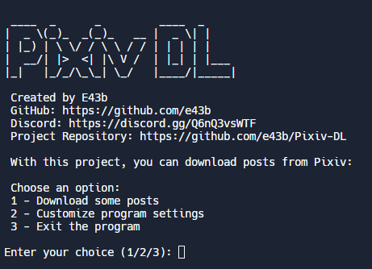
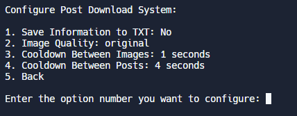

# Pixiv DL

###### [ English](README.md) | [ Português](README-ptbr.md)

Pixiv DL é uma ferramenta versátil projetada para baixar ilustrações, mangás e comics do site Pixiv [Pixiv](https://www.pixiv.net/).

## Funcionalidades

- **Download Individual e em Lote**: Baixe posts individuais ou vários posts sequencialmente inserindo os URLs separados por vírgulas.


  
- **Opções de Download Personalizáveis**: Configure a ferramenta para baixar:
  - Arquivos de texto contendo informações do post como ID do post, título, descrição, data do post, tags, ID do perfil do autor, nome do autor e conta do usuário, e links originais das imagens.
  - Escolha baixar imagens na máxima qualidade disponível, qualidade média ou ambas as versões.

- **Intervalos de Espera Ajustáveis**: Personalize os intervalos de tempo entre os downloads:
  - Intervalo padrão entre o download de imagens: 1 segundo.
  - Intervalo padrão entre posts consecutivos: 4 segundos.
 
## Como Usar

1. **Certifique-se de ter o Python instalado em seu sistema.**
2. **Clone este repositório:**

    ```sh
    git clone https://github.com/e43b/Pixiv-DL/
    ```

3. **Navegue até o diretório do projeto:**

    ```sh
    cd Pixiv-DL
    ```

4. **Selecione o idioma desejado:**

    - A pasta `codeen` contém a versão em inglês.
    - A pasta `codept` contém a versão em português.

5. **Execute o script principal:**

    ```sh
    python main.py
    ```

6. **Siga as instruções no menu para escolher o que deseja baixar ou personalizar o programa.**

### Informações do Projeto

- **Criador**: E43b
- **GitHub**: [E43b no GitHub](https://github.com/e43b)
- **Discord**: [Junte-se à comunidade no Discord](https://discord.gg/Q6nQ3vsWTF)
- **Repositório do Projeto**: [Repositório Pixiv-DL](https://github.com/e43b/Pixiv-DL)

### Uso

Para usar o Pixiv DL, forneça os URLs dos posts que deseja baixar, separados por vírgulas. Por exemplo:

```
https://www.pixiv.net/en/artworks/118333815, https://www.pixiv.net/en/artworks/118392690, https://www.pixiv.net/en/artworks/101134236
```

### Configuração

Configure as preferências da ferramenta de acordo com suas necessidades, escolhendo opções de download e períodos de espera.



### Suporte

Para dúvidas, feedback ou para se juntar à comunidade, visite o servidor do [Discord](https://discord.gg/Q6nQ3vsWTF) ou explore o [repositório no GitHub](https://github.com/e43b/Pixiv-DL).

---

Sinta-se à vontade para personalizar ainda mais este modelo de README.md com base no seu uso específico ou em recursos adicionais do Pixiv DL!
